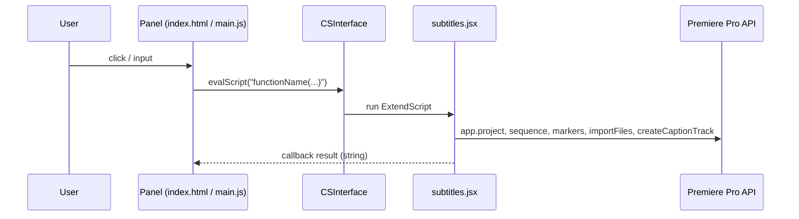

# Developer documentation — Click and Align Subtitle Tool

Audience: maintainers extending or debugging the Premiere CEP extension.

## Architecture

The panel is a **CEP** HTML/JS UI. Premiere host logic runs as **ExtendScript** in `jsx/subtitles.jsx`. The bridge is **Adobe CSInterface** (`evalScript`).

| Layer | Role |
|--------|------|
| `index.html` | Layout, controls, loads `CSInterface.js` and `main.js` |
| `main.js` | `evalScript` calls, loads JSX once via `$.evalFile`, UI state (focus, word spacing) |
| `subtitles.jsx` | File I/O, subtitle model, markers, SRT build, caption track import |
| `CSXS/manifest.xml` | Extension id, CEP version, panel entry |

## UI → ExtendScript map

| UI element (`index.html` id) | `main.js` action | ExtendScript called |
|------------------------------|------------------|---------------------|
| `setText` | Select file | `$.evalFile(…/jsx/subtitles.jsx)` then `main()`; then `getCurrentFileName()` |
| `startText` | Mark start | `toggleStartMark()` → `getCurrentSubtitle()` |
| `endText` | Mark end | `markEnd('static')` → `getCurrentSubtitle()` |
| `addCaptionsNow` | Export captions | `setWordSpacing` if needed, then `addCaptionsNow()` |
| `reset` | Reset | `resetSubtitles()`; clears panel; `currentFileName = null` |
| `wordSpacingSlider` / `wordSpacing` / up/down | Spacing | `loadStaticScript()`; `setWordSpacing(n)` |

On `DOMContentLoaded`, `main.js` runs `loadStaticScript()`, applies default word spacing via `setWordSpacing`, and polls `checkToolStatus` (~1s) so the panel shows active/inactive styling when a sequence exists and the panel is visible/focused.

**Note:** `markStart(mode)` exists in `subtitles.jsx` but is **not** wired from the panel; the Start button uses **`toggleStartMark()`** only.

## State model

| What | Where |
|------|--------|
| Loaded lines, current index, per-line `start`/`end`, file name, word spacing | ExtendScript globals in `subtitles.jsx` (`subtitleLines`, `currentIndex`, `currentFileName`, `wordSpacingSetting`) |
| Persisted session snapshot | `Folder.userData` + `static_subtitle_tool_state.json` (`saveSubtitleState` / `loadSubtitleState` / `clearSubtitleState`) |
| Temp SRT for import | `Folder.temp` + `temp_subtitles_<timestamp>.srt` |

A line is **exportable** only if both `start` and `end` are set (`autoCreateCaptionTrackFromSubtitles` skips incomplete lines).

## Caption export flow

1. Build SRT text from completed lines; apply `applyWordSpacing` using `wordSpacingSetting`.
2. Write UTF-8 LF (no BOM) to temp file; `app.project.importFiles` into insertion bin.
3. If bin item count does not increase, rewrite same path with **CRLF + UTF-8 BOM** and import again.
4. `activeSequence.createCaptionTrack(importedSRT, 0)`.

## Major functions — `main.js`

| Function | Purpose |
|----------|---------|
| `safeEvalScript(script, callback)` | Calls `csInterface.evalScript` when available; otherwise invokes callback with `null`. |
| `safeGetSystemPath(pathType)` | Wraps `getSystemPath`; returns `null` if CEP unavailable. |
| `loadStaticScript()` | Once per session: resolves extension folder, runs `$.evalFile("…/jsx/subtitles.jsx")`. |
| `normalizeWordSpacing(value)` | Parses float; clamps to **1–15** (invalid → 1). |
| `updateWordSpacing(spacing)` | Syncs slider/input UI and calls `setWordSpacing(normalized)` in host. |
| `updateTextBox(subtitleText)` | Sets `#subtitleText` textarea value. |
| `checkToolStatus()` | Queries whether an active sequence exists; combines with panel visibility and window focus to toggle `.tool-active` / `.tool-inactive`. |
| `updateToolStatus(active)` | Applies CSS classes on `.container`. |

`window.setTextBox` is assigned so host-side code can target the panel textarea; `subtitles.jsx` uses `app.setTextBox` when that API exists, while the panel also refreshes text via `getCurrentSubtitle` callbacks.

## Major functions — `subtitles.jsx`

### Utilities and file I/O

| Function | Purpose |
|----------|---------|
| `logEvent(msg)` | `$.writeln` + optional `app.setSDKEventMessage` for diagnostics. |
| `readFileAsBinary(file)` | Reads file as `BINARY` (byte string per char 0–255). |
| `decodeUTF8(byteString)` | UTF-8 decoder (BOM, multi-byte, surrogate pairs); invalid bytes → U+FFFD. |
| `readTextFileTolerant(file)` | Sniffs BOM; tries **UTF-8** / **UTF-16** reads until content succeeds. |
| `normalizeAndFilterLines(rawText)` | Normalizes newlines, trims/splits non-empty lines for `.txt` mode. |

### Spacing and modes

| Function | Purpose |
|----------|---------|
| `applyWordSpacing(line, spacing)` | Replaces runs of spaces with **N** normal spaces + thin spaces (U+2009) for fractional part. |
| `setWordSpacing(value)` | Clamps and stores `wordSpacingSetting` (used at export). |
| `setSubtitleMode(mode)` | Only accepts `'static'`; shows alert (legacy hook). |

### Parsing and load

| Function | Purpose |
|----------|---------|
| `parseSRT(srtText)` | Parses SubRip blocks into `{ text, start, end }` time objects. |
| `main()` | File dialog (`.txt` / `.srt`); fills `subtitleLines`; `.txt` lines get `start`/`end` null; shows first line via `updateTextBoxWithCurrentSubtitle`. |

### Marking and markers

| Function | Purpose |
|----------|---------|
| `markStart(mode)` | **Not used by panel.** Similar toggle logic to `toggleStartMark` for static mode. |
| `toggleStartMark()` | First click: set `start`, marker at playhead. Second click (before separate End): set `end`, advance index, start next line at same time; may call `autoCreateCaptionTrackFromSubtitles` when done. |
| `markEnd(mode)` | Requires `start`; sets `end`, marker span, advances index; may auto-finish all. |
| `insertSubtitleMarker(startTime, endTime, text)` | `sequence.markers.createMarker`; name `"Static Subtitle"`; `comments` = text; `marker.end` = end seconds. |

### UI sync and getters

| Function | Purpose |
|----------|---------|
| `getCurrentSubtitle()` | Returns text for `currentIndex`, or `""` if past end. |
| `getCurrentFileName()` | Returns `currentFileName` or `""`. |
| `updateTextBoxWithCurrentSubtitle()` | Pushes current line to `app.setTextBox` if defined. |

### Time formatting and export

| Function | Purpose |
|----------|---------|
| `pad(num, size)` | Zero-pads for time strings. |
| `formatTime(t)` | `Time` object → `HH:MM:SS,mmm` for SRT. |
| `addCaptionsNow()` | Calls `autoCreateCaptionTrackFromSubtitles()` (export anytime). |
| `autoCreateCaptionTrackFromSubtitles()` | Builds SRT from completed lines, writes temp file, import + retry, `createCaptionTrack`. |

### Reset and persistence

| Function | Purpose |
|----------|---------|
| `resetSubtitles()` | Clears arrays/index/filename/spacing; removes markers named `"Static Subtitle"`; `clearSubtitleState()`. |
| `saveSubtitleState()` | Writes JSON (`subtitleLines`, `currentIndex`, `mode`) to user data file. |
| `loadSubtitleState()` | Restores from JSON if file exists. |
| `clearSubtitleState()` | Deletes persistence file. |

---

## Detailed reference — important functions

The sections below spell out behavior, preconditions, and side effects that the summary tables omit.

### `main.js`

#### `safeEvalScript(script, callback)`

- **Parameters:** `script` — string passed verbatim to ExtendScript; `callback` — optional; receives the string result from Premiere (or `undefined`-ish) on success.
- **Behavior:** If `csInterface.evalScript` exists, calls it inside `try/catch`. On missing CEP or thrown error, calls `callback(null)` when a callback was provided.
- **Note:** Used for status checks and script load; many UI actions call `csInterface.evalScript` directly instead.

#### `safeGetSystemPath(pathType)`

- **Returns:** System path string from CEP, or `null` if unavailable / error.
- **Usage:** `loadStaticScript` uses `SystemPath.EXTENSION` to locate `jsx/subtitles.jsx` for `$.evalFile(...)`.

#### `loadStaticScript()`

- **Purpose:** Ensure ExtendScript definitions from `subtitles.jsx` are loaded once per panel lifetime.
- **Behavior:** If `staticScriptLoaded` is false, resolves extension root via `safeGetSystemPath(SystemPath.EXTENSION)`, builds `…/jsx/subtitles.jsx`, runs `safeEvalScript('$.evalFile("' + scriptPath + '")')` (no callback). Sets `staticScriptLoaded = true` after the attempt, including when the extension path is missing (script load may not have run).
- **Side effects:** Redefines all global functions in `subtitles.jsx` in the host engine on first successful eval.

#### `normalizeWordSpacing` / `updateWordSpacing`

- **`normalizeWordSpacing`:** `parseFloat`; if `NaN` or `< 1` → `1`; if `> 15` → `15`.
- **`updateWordSpacing`:** Updates slider and number input to the normalized value (`toFixed(1)` on input), calls `loadStaticScript()`, then `evalScript("setWordSpacing(" + normalized + ")")` so the host stores `wordSpacingSetting` for export.

#### `checkToolStatus()` / `updateToolStatus(active)`

- **`checkToolStatus`:** Evaluates `app.project && app.project.activeSequence ? 'active' : 'inactive'`. Treats the tool as **active** only if the sequence check passes **and** the document has focus (`hasWindowFocus`) **and** `document.visibilityState === 'visible'`. Otherwise calls `updateToolStatus(false)`.
- **`updateToolStatus`:** Toggles `.tool-active` / `.tool-inactive` on `.container` when the derived active state changes (reduces DOM churn).

---

### `subtitles.jsx`

#### `main()`

- **Preconditions:** `app.project` must exist; otherwise alerts and returns.
- **Flow:** Resets `subtitleLines` and `currentIndex`. Opens `File.openDialog` for `*.txt;*.srt`. Sets `currentFileName` from the chosen file.
- **`.srt`:** Reads with `readTextFileTolerant`, `parseSRT(srtText)` → `subtitleLines` entries with `text` plus `start`/`end` parsed from cues. Marking with **Mark Start** / **Mark End** updates those entries using the playhead (`Time` from `getPlayerPosition()`).
- **`.txt` (anything else):** Reads with `readTextFileTolerant`, `normalizeAndFilterLines` → each non-empty line becomes `{ text: "<line>", start: null, end: null }`.
- **End state:** `currentIndex = 0`, alert with line count, `updateTextBoxWithCurrentSubtitle()` (and `app.setTextBox` if defined).

#### `toggleStartMark()` — state machine (Mark Start button)

Uses `app.project.activeSequence.getPlayerPosition()` as the current time.

| Current line state | Action |
|--------------------|--------|
| `start === null` | Set `start = time`. `insertSubtitleMarker(time, time, text)`. Refresh UI. |
| `start` set, `end === null` | Validate `time.seconds > start.seconds`. Set `end = time`. Replace marker span with `insertSubtitleMarker(start, time, text)`. Increment `currentIndex`. If more lines remain, set **next** line’s `start = time` and add a zero-length marker at `time` for that text. `saveSubtitleState()`. If that was the last line, call `autoCreateCaptionTrackFromSubtitles()` and return. |
| `start` and `end` both set | No branch matches; **no-op** for this line (should not occur for the active index in normal use). |

#### `markEnd(mode)` — Mark End button (`mode` is `'static'` from the panel)

- **Preconditions:** Active sequence; `currentIndex < subtitleLines.length`; current line must have `start !== null` (otherwise alert: mark Start first).
- **Validation:** End time must be after start (`time.seconds > start.seconds`).
- **Effects:** Sets `end`, `insertSubtitleMarker(start, end, text)`, increments `currentIndex`.
- **Difference from second `toggleStartMark` click:** Does **not** set the next subtitle’s `start` to the current playhead. The next line stays unstarted until the user clicks Mark Start again.
- **Completion:** If `currentIndex >= subtitleLines.length`, calls `autoCreateCaptionTrackFromSubtitles()` and returns; else `updateTextBoxWithCurrentSubtitle()` and `saveSubtitleState()`.

#### `insertSubtitleMarker(startTime, endTime, text)`

- **Preconditions:** `app.project.activeSequence` exists.
- **Behavior:** `seq.markers.createMarker(startTime.seconds)`; sets `marker.name = "Static Subtitle"`, `marker.comments = text`, `marker.end = endTime.seconds`.
- **Note:** A “start-only” mark uses `startTime === endTime` (point marker / zero duration until updated by a later call with a wider range).

#### `applyWordSpacing(line, spacing)`

- **Behavior:** Collapses each run of spaces in `line` to: `floor(spacing)` normal spaces, plus thin spaces (U+2009) approximating the fractional part (`round((spacing - floor) * 5)`, minimum 1 thin space if fractional part > 0).
- **Used when:** Building SRT body text in `autoCreateCaptionTrackFromSubtitles`.

#### `autoCreateCaptionTrackFromSubtitles()`

- **Early exits:** Empty `subtitleLines`; no lines with both `start` and `end` → alert “No timed subtitles available to export.”; cannot write temp file; no active sequence; no destination bin; import does not add a project item after two attempts; missing imported item; `createCaptionTrack` returns falsy — each surfaces an alert (and `logEvent` where used).
- **SRT assembly:** Iterates all `subtitleLines`; skips incomplete entries. Cue index `idx` starts at 1 and increments only for included lines. Times formatted with `formatTime` (from `Time.seconds` in Premiere).
- **Temp file:** `Folder.temp/fsName + "/temp_subtitles_" + Date.getTime() + ".srt"`.
- **Import:** `getInsertionBin()` if available, else `rootItem`. Compares `destBin.children.numItems` before/after `importFiles([tempFile.fsName], true, destBin, false)`.
- **Retry:** If count did not increase, rewrites the **same** path with UTF-8, CRLF, BOM, imports again. Picks `destBin.children[afterCount - 1]` as the imported clip for `seq.createCaptionTrack(importedSRT, 0)`.

#### `addCaptionsNow()`

- Thin wrapper: logs via `logEvent`, then calls `autoCreateCaptionTrackFromSubtitles()`. Use when the user exports before all lines are marked (only completed pairs export).

#### `resetSubtitles()`

- Clears `subtitleLines`, `currentIndex`, `currentFileName`, resets `wordSpacingSetting` to `1`.
- **Markers:** Walks `activeSequence.markers` with `getFirst()` / `getNext()`, removes any marker whose `name === "Static Subtitle"`.
- **Persistence:** `clearSubtitleState()` removes the JSON file. Alerts the user when done.

#### `saveSubtitleState()` / `loadSubtitleState()` / `clearSubtitleState()`

- **saveSubtitleState:** Writes `{ subtitleLines, currentIndex, mode: 'static' }` as JSON to `Folder.userData + "/static_subtitle_tool_state.json"` (UTF-8). Called after marking steps that advance state (`toggleStartMark` branch, `markEnd`).
- **loadSubtitleState:** Reads that file if present, restores globals, `updateTextBoxWithCurrentSubtitle()`. **Not called from `main.js` today** — persistence is written but not auto-restored on panel open unless something else invokes it.
- **clearSubtitleState:** Deletes the JSON file if it exists (used from `resetSubtitles`).

#### `markStart(mode)` (legacy / unused from UI)

- Logic mirrors `toggleStartMark` for the static two-click-on-Start pattern. The panel does not call it; prefer `toggleStartMark` or remove dead code in a future cleanup.

---

## Extension manifest (source of truth)

Values below come from `CSXS/manifest.xml` (prefer this over older copies in other docs).

| Item | Value |
|------|--------|
| Bundle ID | `com.planetread.clickandalign.subtitle` |
| Bundle version | `2.0.0` |
| Panel extension ID | `com.planetread.clickandalign.subtitle.panel` (panel `Version` **2.0.0**) |
| Premiere host | `PPRO`, version range **`[25.0, 99.9]`** |
| CEP runtime | CSXS **`12.0`** |
| Panel entry | `MainPath`: `./index.html` |
| Host script registration | `ScriptPath`: `./jsx/subtitles.jsx` (Premiere also loads definitions; the panel still calls `$.evalFile` for the same file in `loadStaticScript()` — behavior is effectively “ensure script is present.”) |
| Default panel size | 400 × 800 |
| CEF flags | `--enable-nodejs`, `--mixed-context` |

Menu label in Premiere: **Window → Extensions → Click and Align Subtitle Tool** (see `<Menu>` in the manifest).

---

## Debugging

### Panel UI (`main.js`, DOM)

1. Enable **PlayerDebugMode** for your CSXS major version (same as running unsigned extensions during development).
2. Add a **`.debug`** file in the extension root (alongside `CSXS/`) so Chromium-based CEP exposes a debug port. Use the panel extension id and host `PPRO`; see Adobe’s CEP materials for the XML shape (e.g. [CEP HTML Test Extension / debugging guides](https://github.com/Adobe-CEP/CEP-Resources)).
3. Restart Premiere, open the panel, then open `http://127.0.0.1:<port>` in Chrome or Edge to attach DevTools. **`console.log`** output from `main.js` appears there.

### ExtendScript (`subtitles.jsx`)

- **`$.writeln`** — logs to the ExtendScript / host console when attached (workflow depends on your Premiere/scripting setup).
- **`logEvent`** — writes to `$.writeln` and, when available, **`app.setSDKEventMessage(..., 'info')`** for lightweight in-app diagnostics.

---

## Known issues and follow-ups

| Topic | Detail |
|--------|--------|
| Session restore | **`loadSubtitleState()`** is implemented in `subtitles.jsx` but **not** called from `main.js`. State is saved after marking, but reopening the panel does not automatically reload JSON unless you wire `loadSubtitleState` (e.g. on `DOMContentLoaded` after `loadStaticScript()`). |
| Text area after file pick | After **`main()`**, `main.js` calls **`updateTextBox(0)`**, which sets the textarea to the string **`"0"`**, not the first subtitle line. The comment in code is misleading. First line usually appears after the next sync (e.g. **`getCurrentSubtitle()`** after Mark Start/End). Consider replacing with `evalScript("getCurrentSubtitle()", …)` + `updateTextBox(text)`. |
| Dead code | **`markStart(mode)`** is unused by the UI; safe to remove or wire intentionally. |
| README vs manifest | Any **bundle ID** in user-facing docs should match **`com.planetread.clickandalign.subtitle`**. |

---

## Data locations and privacy

| Data | Location |
|------|-----------|
| Temp SRT for import | `Folder.temp` — `temp_subtitles_<timestamp>.srt` (see `autoCreateCaptionTrackFromSubtitles`) |
| Saved session JSON | `Folder.userData` — `static_subtitle_tool_state.json` |

Subtitle workflows in **`main.js`** and **`subtitles.jsx`** do not send data over the network. **`CSInterface.js`** is Adobe’s library and may contain generic helpers (e.g. XHR); this extension does not add its own remote calls for subtitle features.

---

## Manual testing checklist

Use when changing host or panel code.

- [ ] **Install / load:** Extension appears under **Window → Extensions**; panel opens without errors.
- [ ] **TXT:** UTF-8 (and optionally UTF-16) file loads; empty lines skipped; first line shown after marking or after fixing `updateTextBox` behavior.
- [ ] **SRT:** File loads; marking updates timing from playhead as expected.
- [ ] **Mark Start (twice):** First click sets start; second sets end, advances cue, starts next at same time; markers named **Static Subtitle** appear.
- [ ] **Mark Start + Mark End:** End does not auto-start next line at playhead; next line waits for another Mark Start.
- [ ] **Word spacing:** Slider updates export spacing (visually check caption track).
- [ ] **Add Completed Captions:** Exports only pairs with start **and** end; caption track created; retry path (CRLF + BOM) if first import fails on your build.
- [ ] **Reset:** Clears state, removes **Static Subtitle** markers, JSON cleared.
- [ ] **Tool state styling:** With sequence open, panel shows active styling when focused/visible; inactive when timeline focused (blur) per `checkToolStatus`.

---

## Related files

- `CSInterface.js` — Adobe CEP bridge (third-party library).
- `CSXS/manifest.xml` — Extension metadata, host list, panel geometry, `ScriptPath` / `MainPath`.
